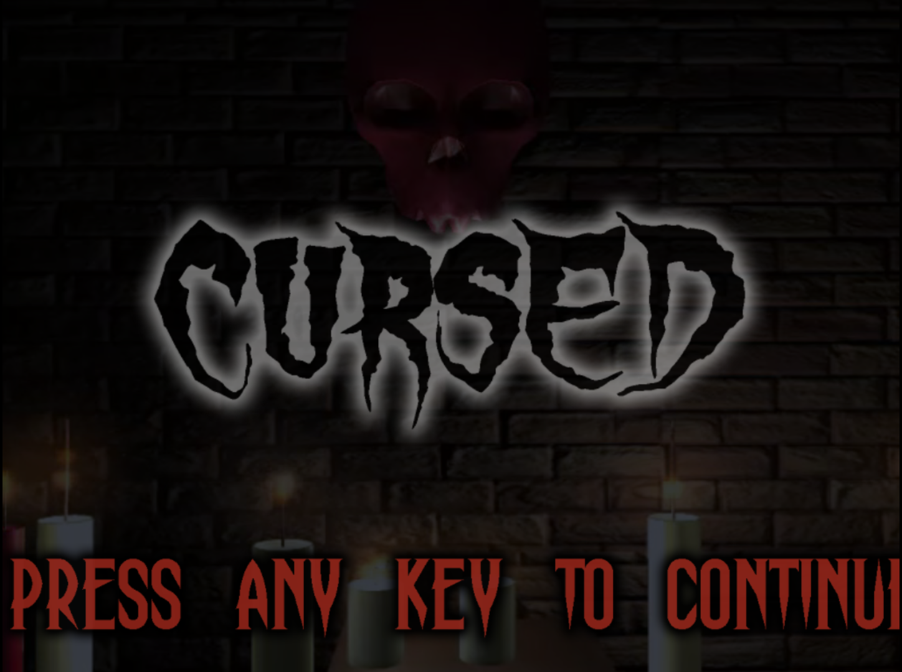
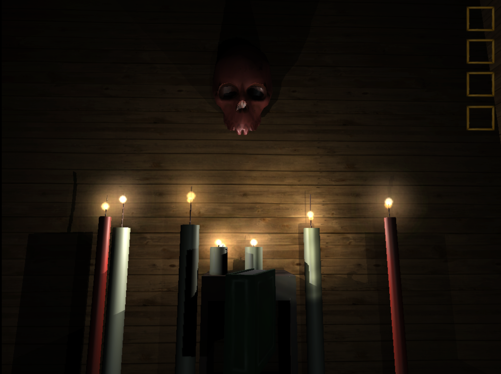

# 🏚️ Cursed – Escape the Haunted Mansion

**Cursed** is a 3D horror puzzle game developed during **Global Game Jam 2016**, where you play as a cursed individual who wakes up in a haunted mansion. Your goal: find the necessary items to complete a dark ritual and break the curse before it's too late.

---

## 🎮 Game Summary

You awaken alone in a mysterious, haunted mansion. To escape, you must explore the environment, search for key ritual components, and survive long enough to complete the spell and lift the curse.

- **Theme:** "Ritual" – Global Game Jam 2016
- **Genre:** First-person horror / puzzle exploration
- **Platform:** Windows PC
- **Gameplay:** Explore, collect, survive, and perform the ritual

---

## 🧠 Core Features

- First-person 3D horror gameplay
- Exploration-focused mechanics
- Puzzle-solving through item collection
- Ritual-based progression system
- Atmospheric environment and ambient sound

---

## 🛠️ Tools & Technologies

- **Engine:** Unity
- **3D Modeling:** Blender, Maya
- **Art & Texturing:** Photoshop

---

## ▶️ How to Play (Windows Build)

1. Open the `Build/` folder
2. Run `Cursed.exe`
3. Explore the mansion, collect ritual items, and perform the spell to escape

> ⚠️ Antivirus software may block `.exe` files. Please allow it manually if needed.

---

## 🧑‍💻 Development Team (Global Game Jam 2016)

- **Guilherme Almeida (Guijeff)** – Programmer & Game Designer  
- **Leandro Pereira (Orthovasky)** – Programmer & 3D Modeler  
- **Victor Takaki** – Programmer & Sound Designer  
- **Diego Gomes** – 3D Modeler, Programmer & Level Designer  
- **Érico Kazuiti (Drakuario)** – 3D Artist & 2D Artist

---

## 📥 Download

If GitHub blocks the download due to size limits, use this alternative:

🔗 [Download via Google Drive](https://drive.google.com/file/d/1towzpJ_TqCG6WGqnjdwlr0DP4ntEZ5_j/view?usp=drive_link)

---

## 📸 Screenshots / Demo

### Main Menu

### Game

---

## ⚠️ License & Source Code

This repository contains only the **game build** created during **Global Game Jam 2016**.  
The source code is not publicly available.  
Redistribution or commercial use is not permitted.

---

**Created in 48 hours during [Global Game Jam 2016](https://globalgamejam.org/2016/games)**  
Theme: *"Ritual"*
